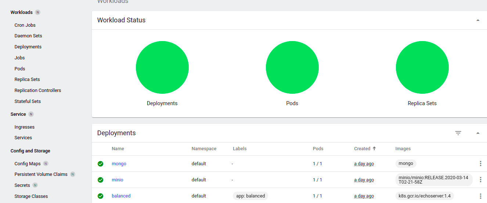
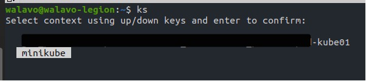
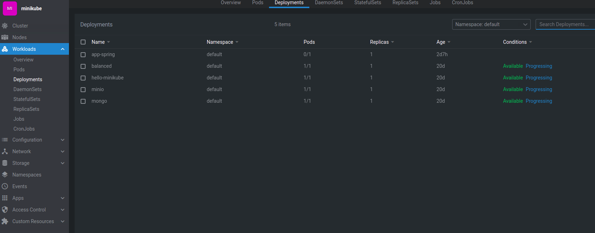
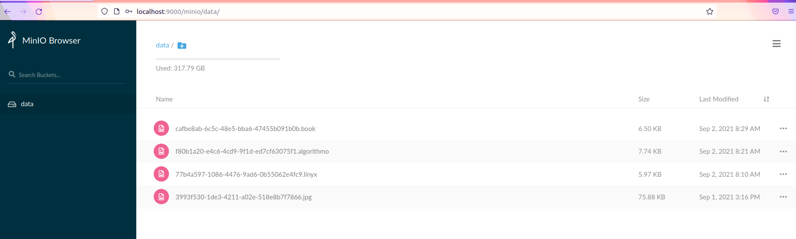
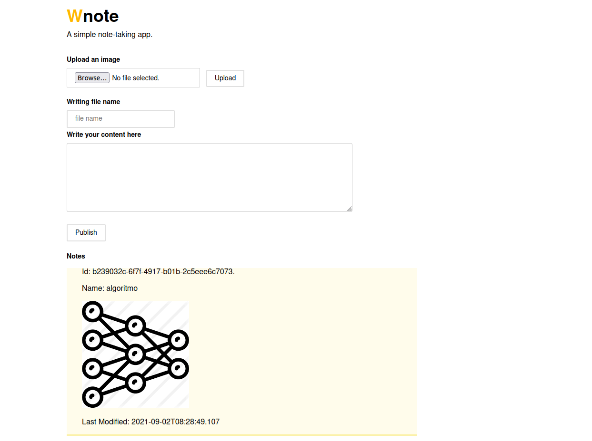

# Project Spring Deployment Kubernetes

## Create Cluster Kubernetes with Minikube

```shell
$ curl -LO https://storage.googleapis.com/minikube/releases/latest/minikube-linux-amd64
$ sudo install minikube-linux-amd64 /usr/local/bin/minikube
```

```shell
$ minikube start
```

```shell
$ minikube dashboard --url
```



```shell
$ minikube stop
```


-----
# Cheatsheet Kubernetes

### Some basic commands
:mag_right: [Kubectl](https://kubernetes.io/docs/reference/kubectl/cheatsheet/)
---

### Kubectl autocomplete

```shell
$ source <(kubectl completion bash)
$ echo "source <(kubectl completion bash)" >> ~/.bashrc
```

### Kubeselect kubernetes cluster

Select k8s contexts configured in your :open_file_folder: *~/.kube/config*

```shell
$ git clone https://github.com/fatliverfreddy/kubeselect.git
$ cd kubeselect
$ chmod +x kubeselect
$ echo "alias ks=./kubeselect" >> ~/.bashrc
$ ks 
```



:mag_right: [kubeselect](https://github.com/fatliverfreddy/kubeselect)
---


### Kubernetes Lens

This is a tool to manage kubernetes clusters locally.

:mag_right: [k8slens](https://k8slens.dev/)
---




----


```shell
$ kubectl config get-contexts
$ kubectl config use-context minikube
```

```shell
$ kubectl create deployment nginx --image=nginx
```

```shell
$ kubectl create namespace local
```

```shell
$ kubectl get po -A
```

## Export environment

:file_folder: /kubernetes-spring

```bash
$ source ./env.sh
```

```shell
$ gcloud auth login
$ gcloud config list
```

```bash
$ gcloud auth configure-docker
```

```bash
$ kubectl get secrets
```

```shell
$ kubectl get serviceaccount default -o yaml
```

```shell
$ kubectl patch serviceaccount default -p '{"imagePullSecrets": [{"name": "gcr-json-key"}]}'
` ``

```shell
$ kubectl create secret docker-registry gcr-json-key --docker-server=eu.gcr.io  --docker-username=_json_key --docker-password="$(cat ./account.json)" --docker-email=${PROJECT_EMAIL}
```

```bash
$ docker build --build-arg ARTIFACT_ID . -t app-spring:1.0.0
$ docker tag app-spring:1.0.0 gcr.io/${PROJECT_ID}/app-spring:1.0.0
```

```bash
$ docker push gcr.io/${PROJECT_ID}/app-spring:1.0.0
```

```shell
$ kubectl apply -f kube/mongo.yaml
$ kubectl apply -f kube/minio.yaml
$ kubectl apply -f kube/app-spring.yaml
```





```shell
$ kubectl port-forward service/mongo 27017:27017
$ kubectl port-forward service/minio 9000:9000
$ kubectl port-forward service/app-spring 8080:8080
```

```shell
$ minikube service mongo
$ minikube service minio
$ minikube service app-spring
```

# References

[Minikube](https://minikube.sigs.k8s.io/docs/start/)

[Kubernetes Service Account](https://blog.container-solutions.com/using-google-container-registry-with-kubernetes)