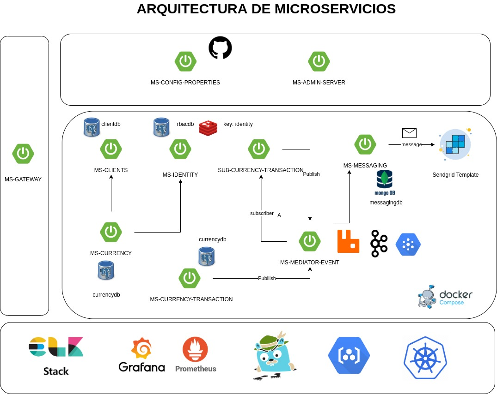

## ARQUITECTURA DE MICROSERVICIOS

>La arquitectura de microservicios (en inglés, Micro Services Architecture, MSA) es una aproximación para el desarrollo de software que consiste en construir una aplicación como un conjunto de pequeños servicios, los cuales se ejecutan en su propio proceso y se comunican con mecanismos ligeros (normalmente una API de recursos HTTP). Cada servicio se encarga de implementar una funcionalidad completa del negocio. Cada servicio es desplegado de forma independiente y puede estar programado en distintos lenguajes y usar diferentes tecnologías de almacenamiento de datos.1​

[Microservice Bible](https://microservices.io/patterns/index.html)



## technologies

* Spring Boot
* Java RX
* Spring Security with Jwt 2.0
* Spring JMS, AMQP (Rabbitmq y Kafka) 
* Spring PubSub
* Spring Actuator with Prometheus
* Spring Boot Admin
* Spring WebFlux with WebClient
* Spring Retry (Circuit Breaker)
* SDK Sendgrid
* Container Registry (GCP)
* Docker Compose
* Open Tracing (Jaeger)
* Logging Centralizer (ELK)
* Monitoring and Grafana (Prometheus)
* Data Bases (Redis, MongoDB and Postgres db)

## Patrones de Microservicios

|               Patterns            |              Approved            |
|-----------------------------------|----------------------------------|
| Decompose by business capability  |          :heavy_check_mark:      |
| Database per Service              |          :heavy_check_mark:      |
| Externalized configuration        |          :heavy_check_mark:      |
| CQRS and API Composition          |          :heavy_check_mark:      |
| API Gateway                       |          :heavy_check_mark:      |
| Access Token                      |          :heavy_check_mark:      |
| Circuit Breaker (Reliability)     |          :heavy_check_mark:      |
| Observability                     |          :heavy_check_mark:      |
| Mediator                          |          :heavy_check_mark:      |
| Factory and Adapter               |          :heavy_check_mark:      |

## Inicializar Network en docker

```bash
$ docker network create -d bridge microservice
```

## Export los environment para levantar los contenedores 

```bash
$ source /tools/env/environment.sh
```

## Levantar contenedor de kafka server

:file_folder: /tools/kafka

```bash
docker-compose up -d
```

## Levantar contenedor de ELK

:file_folder: /tools/logging

```bash
docker-compose up -d
```

## Levantar contenedor de Grafana de Prometheus

:file_folder: /tools/metrics

```bash
docker-compose up -d
```

## Levantar contenedor de Mongo server

:file_folder: /tools/mongo

```bash
docker-compose up -d
```


## Levantar contenedor de Mongo server

:file_folder: /tools/mongo

```bash
docker-compose up -d
```

## Levantar contenedor de Postgres server

:file_folder: /tools/postgres

```bash
docker-compose up -d
```

## Levantar contenedor de Redis server

:file_folder: /tools/postgres

```bash
docker-compose up -d
```

## Levantar contenedor de Rabbitmq server

:file_folder: /tools/rabbitmq


## Levantar contenedor de Open Tracing

:file_folder: /tools/tracing

```bash
docker-compose up -d
```

## Postman Collection y Environment

root :file_folder: MICROSERVICE_APIS.postman_collection.json

root :file_folder: MICROSERVICE.postman_environment.json

## Startup los microservicios con docker componse

:file_folder: /tools/docker-compose

```bash
docker-compose up -d
```

#### References

[Kafka image](https://hub.docker.com/r/bitnami/kafka/)

[Kafka](https://www.paradigmadigital.com/dev/comunicacion-microservicios-apache-kafka/)

[Netflix Microservice](https://netflix.github.io/)

[Initializer Spring](https://start.spring.io/)

[Persistence ORM](https://github.com/vladmihalcea/hibernate-types)

[Docker Network](https://runnable.com/docker/docker-compose-networking)

[Spring Boot ADMIN](https://codecentric.github.io/spring-boot-admin/current/#_what_is_spring_boot_admin)

[Jaeger](https://medium.com/xebia-engineering/jaeger-integration-with-spring-boot-application-3c6ec4a96a6f)

[Sendgrid](https://app.sendgrid.com/guide/integrate/langs/java)