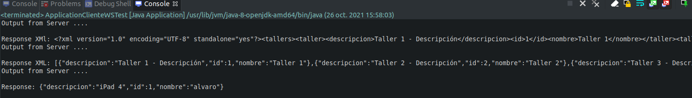

## Service Web y Soap

### Stack

  * Spring mvc
  * Jersey
  * Java EE
  * Jaxb api
  * Validation bean
  * Http Connection
  * Tomcat ee
  * JPA
  * Java Crypto

### Validation API server

### References

https://spring.io/guides/gs/rest-service/

https://stackoverflow.com/questions/13703807/post-in-restful-web-service

https://www.mkyong.com/java8/java-8-foreach-examples/

https://www.tutorialspoint.com/restful/restful_first_application.htm

https://docs.oracle.com/javaee/6/tutorial/doc/giepu.html

https://stackoverflow.com/questions/36939633/tomcat-servlet-mapping-vs-webservlet-annotation
https://www.mkyong.com/webservices/jax-rs/restfull-java-client-with-java-net-url/

https://github.com/jmarkstar?tab=repositories